# Dunder Mifflin Enterprise WAN

## Background

Designing an enterprise wide area network (WAN) for Dunder Mifflin using Layer 3 Virtual Private Network (L3VPN) over Multiprotocol Label Switching (MPLS) is a comprehensive task that requires careful planning and consideration of various factors such as security, scalability, performance, and cost. Below is a detailed background and design overview for this network:

Dunder Mifflin is a mid-sized paper supply company with a headquarters (HQ) and four remote branches located in Nashua, Stamford, Scranton and Buffalo. The company needs a robust, secure, and scalable network to support its business operations, including sales, customer service, logistics, and corporate communications. The network will be designed in an intranet topology. This design simplifies management and routing, with all branches being able to communicated with each other as well as the HQ.

## Network Topology

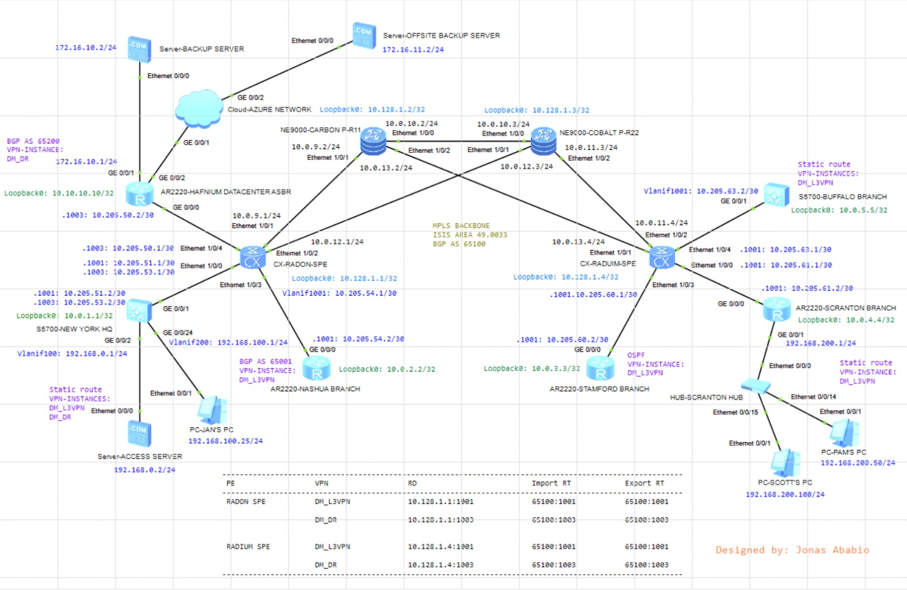

This lab involves the following devices:

- Three servers
- Four AR2200 routers
- Two S5700 switches
- Two CX routers
- Two NE9000 routers
- One hub
- Three PCs

### VLAN Plan

#### VLAN Mapping to VPN Instances

>**1001**: DM_L3VPN : For enterprise services
>
>**1003**: DM_DR : For disaster recovery

| Device name | Interface | Link type | VLAN plan | Description |
| - | :- | :- | :- | :- |
| **Radon SPE** | Eth1/0/3 | Trunk | allow-pass: 1001 | Link to DM_Nashua Branch |
|  | Eth1/0/0 | - | dot1q: 1001, 1003 | Link to DM_New York |
|  | Eth1/0/4 | - | dot1q: 1003 | Link to Hafnium Datacenter ASBR |
| **New York HQ** | GE0/0/1 | Trunk | allow-pass: 1001, 1003 | Link to Radon SPE |
| | GE0/0/2 | Access | default: 100 | Link to Servers |
| | GE0/0/24 | Access | default: 200 | Link to LAN |
| **Nashua Branch** | GE0/0/0 | - | dot1q: 1001 | Link to Radon SPE |
| **Radium SPE** | Eth1/0/3 | Trunk | allow-pass: 1001 | Link to DM_Nashua Branch |
|  | Eth1/0/0 | - | dot1q: 1001 | Link to Scranton Branch |
|  | Eth1/0/3 | - | dot1q: 1001 | Link to Stamford Branch |
|  | Eth1/0/4 | - | dot1q: 1001 | Link to Buffalo Branch |
| **Buffalo Branch** | GE0/0/1 | Trunk | allow-pass: 1001 | Link to Radium SPE |
| **Stamford Branch** | GE0/0/0 | - | dot1q: 1001 | Link to Radium SPE |
| **Scranton Branch** | GE0/0/0 | - | dot1q: 1001 | Link to Radium SPE |
|  | GE0/0/1 | Access | default: 1001 | Link to LAN |

### IP Address Plan

| Device name | Interface | IP Address |
| - | :- | :- |
| **Backup Server** | Ethernet0/0/0 | 172.16.10.2/24 |
| **Offsite Backup Server** | Ethernet0/0/0 | 172.16.11.2/24 |
| **Hafnium Datacenter ASBR** | LoopBack0 | 10.10.10.10/32 |
| | GigabitEthernet0/0/1 | 172.16.10.1/24 |
| | GigabitEthernet0/0/2 | 172.16.11.1/24 |
| | GigabitEthernet0/0/0.1003 | 10.205.50.2/30 |
| **Radon SPE** | LoopBack0 | 10.128.1.1/32 |
| | Ethernet1/0/0.1003 | 10.205.53.1/30 |
| | Ethernet1/0/4.1003 | 10.205.50.1/30 |
| | Ethernet1/0/1 | 10.0.9.1/24 |
| | Ethernet1/0/2 | 10.0.12.1/24 |
| | Ethernet1/0/0.1001 | 10.205.51.1/30 |
| | Vlanif1001 | 10.205.54.1/30 |
| **New York HQ** | LoopBack0 | 10.0.1.1/32 |
| | Vlanif100 | 192.168.0.1/24 |
| | Vlanif200 | 192.168.100.1/24 |
| | Vlanif1001 | 10.205.51.2/30 |
| | Vlanif1003 | 10.205.53.2/30 |
| **Access Server** | Ethernet0/0/0 | 192.168.0.2/24 |
| **Jan's PC** | Ethernet0/0/1 | 192.168.100.25/24 |
| **Nashua Branch** | LoopBack0 | 10.0.2.2/32 |
| | GigabitEthernet0/0/0.1001 | 10.205.54.2/30 |
| **Carbon P-R11** | LoopBack0 | 10.128.1.2/32 |
| | Ethernet1/0/0 | 10.0.10.2/24 |
| | Ethernet1/0/1 | 10.0.9.2/24 |
| | Ethernet1/0/2 | 10.0.13.2/24 |
| **Cobalt P-R22** | LoopBack0 | 10.128.1.3/32 |
| | Ethernet1/0/0 | 10.0.10.3/24 |
| | Ethernet1/0/1 | 10.0.12.3/24 |
| | Ethernet1/0/2 | 10.0.11.3/24 |
| **Radium SPE** | LoopBack0 | 10.128.1.4/32 |
| | Ethernet1/0/0.1001 | 10.205.61.1/30 |
| | Ethernet1/0/1 | 10.0.13.4/24 |
| | Ethernet1/0/2 | 10.0.11.4/24 |
| | Ethernet1/0/3.1001 | 10.205.60.1/30 |
| | Ethernet1/0/4.1001 | 10.205.63.1/30 |
| **Buffalo Branch** | LoopBack0 | 10.0.5.5/32 |
| | Vlanif1001 | 10.205.63.2/30 |
| **Stamford Branch** | LoopBack0 | 10.0.3.3/32 |
| | GigabitEthernet0/0/0.1001 | 10.205.60.2/30 |
| **Scranton Branch** | LoopBack0 | 10.0.4.4/32 |
| | GigabitEthernet0/0/1 | 192.168.200.1/24 |
| | GigabitEthernet0/0/0.1001 | 10.205.61.2/30 |
| **Scott's PC** | Ethernet0/0/1 | 192.168.200.100/24 |
| **Pam's PC** | Ethernet0/0/1 | 192.168.200.50/24 |

## Configuration

### Configuring IP addresses and VLAN based on the above plan

...

### Delopying IS-IS on the backbone network to establish connectivity

The backbone network is made up of four routers i.e Radon, Carbon, Cobalt, Radium

Radon and Radium act as provider edge routers (PE) whiles Carbon and Cobalt act as provider routers (P)

>IS-IS Area: 49.0033
>
>This involves:
>
>Specifying the network entity of the routers using the IS-Area and    LoopBack0: eg. 49.0033.1921.6800.0001.00
>
>Setting parameters such as is-name, is-level and cost-style
>
>Enabling IS-IS on interface to build a routing table

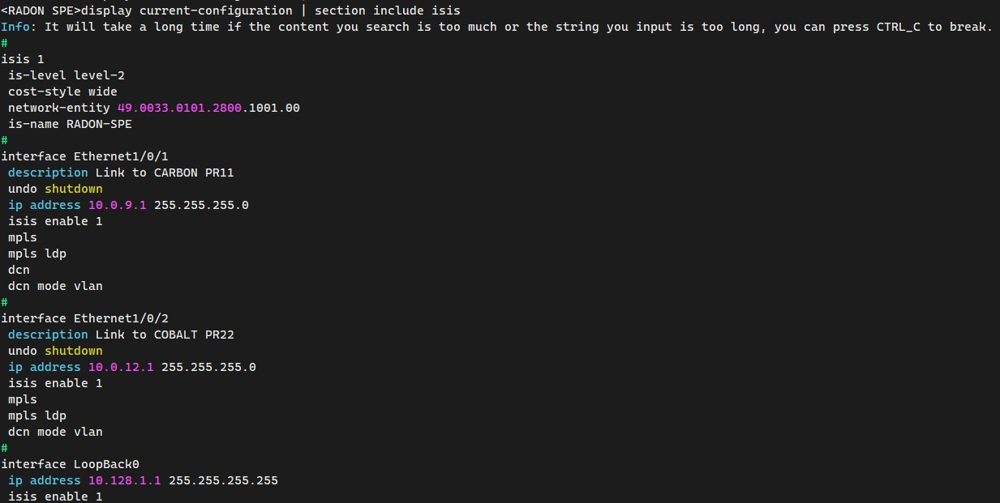

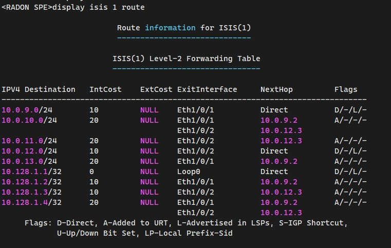

### VPN Plan

Provider edge routers are the only routers within an MPLS domain that are allowed to maintain separate routing tables for each VPN using Virtual Routing and Forwarding (VRF).

PEs use route distinguishers to distinguish between routes from different VPN sites.

| Provider Edge | VPN Instance | Route Distinguisher | Route Target |
| - | :- | :- | :- |
| **Radon SPE** | DM_L3VPN (enterprise services) | 10.128.1.1:1001 | 65100:1001 both import and export |
| | DM_DR (disaster recovery) | 10.128.1.1:1003 | 65100:1003 both import and export |
| **Radim SPE** | DM_L3VPN (enterprise services) | 10.128.1.4:1001 | 65100:1001 both import and export |

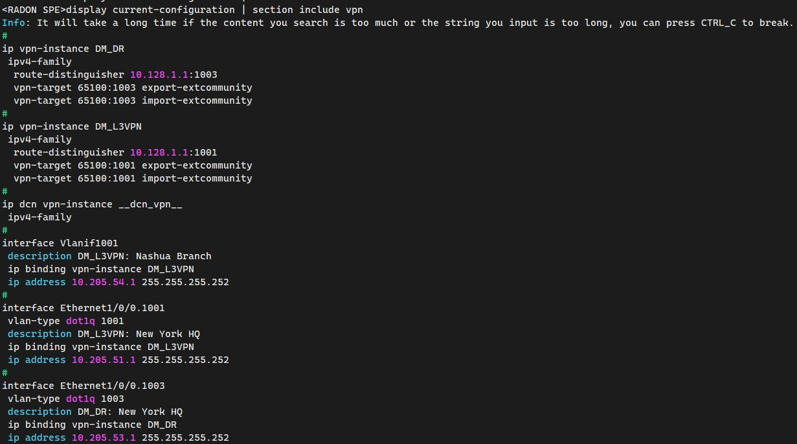

### Deloying MPLS and MPLS LDP on the backbone network

This allows packets to be forwarded across the backbone using dynamic LSPs.

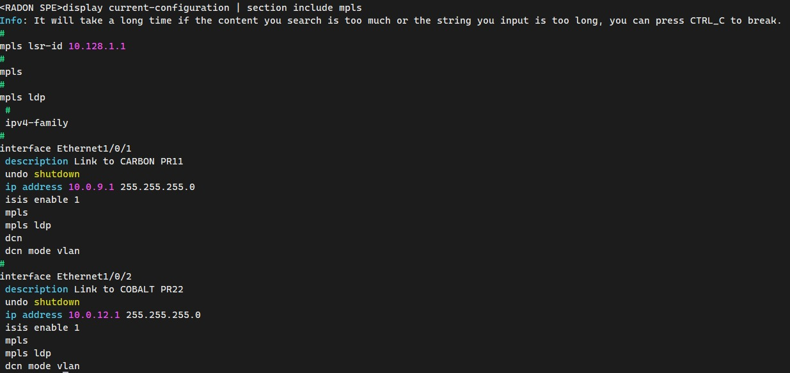

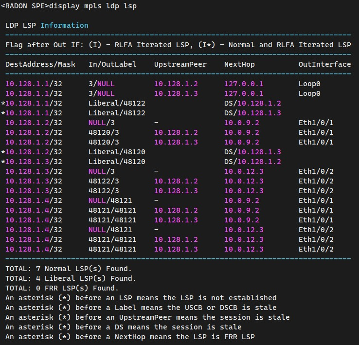

### Creating VPNv4 IBGP peers on the backbone network

MPLS VPN uses BGP to advertise VPN routes. Since Radium and Radon are the only PE in the backbone, they establish an IBGP peer via their LoopBack0 interface.

>AS65100

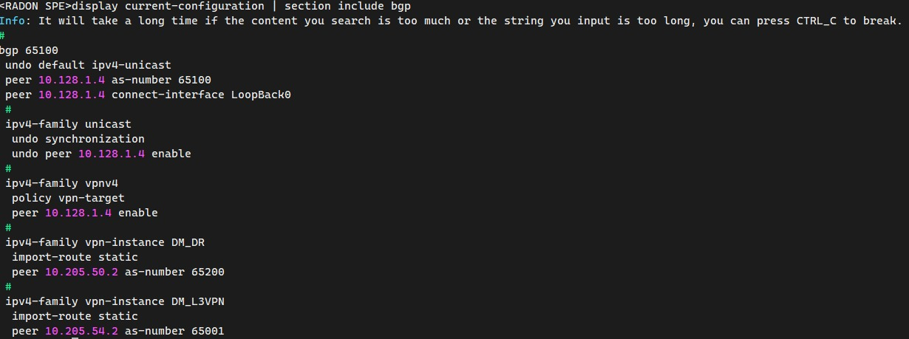

### Configuring route exchange between the PEs and the connected CEs

| PE | CE | Routing Protocol | VPN |
| - | :- | :- | :- |
| **Radon SPE** | New York HQ | Static route | DM_L3VPN, DM_DR |
| | Nashua Branch | BGP AS65001 | DM_L3VPN |
| | Hafnium Datacenter ASBR | BGP AS65200 | DM_L3VPN |
| **Radium SPE** | Stamford Branch | OSPF | DM_L3VPN |
| | Scranton Branch | Static route | DM_L3VPN |
| | Buffalo Branch | Static route | DM_L3VPN |

All branches can communicate with each other but only the HQ is allowed to access the disaster recovery link.

### Testing connectivity

Connectivity between Radon SPE and New York HQ
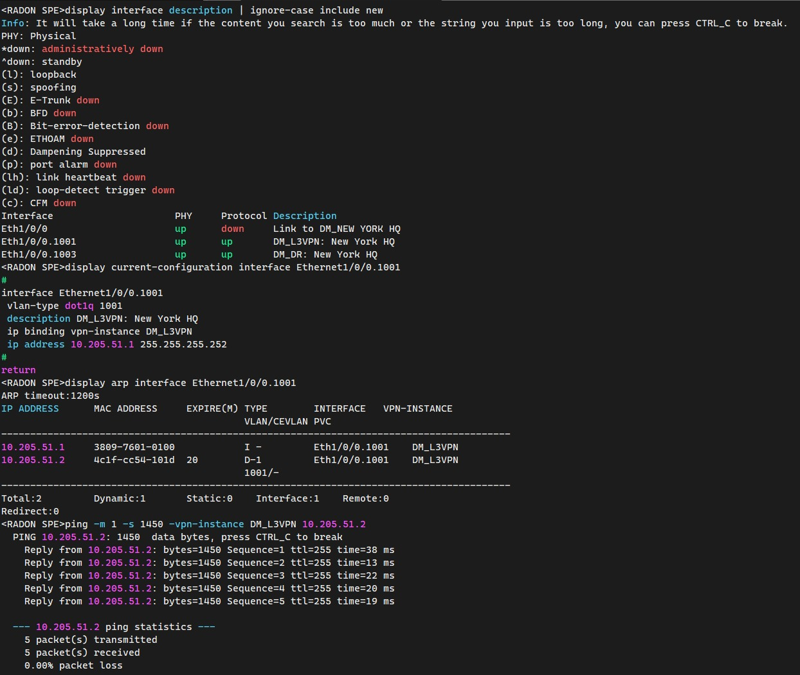

Connectivity between Jan's PC and all remote branches
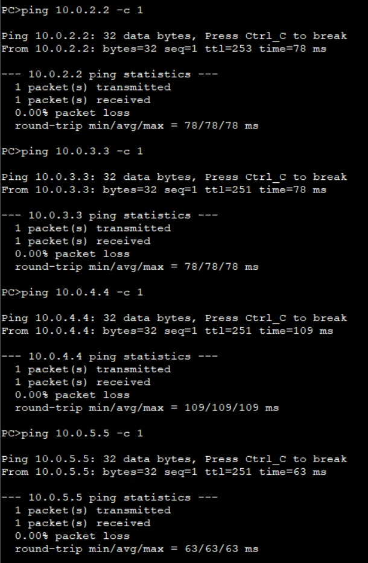

Connectivity between Scott's PC and Jan's PC | Access Server at HQ
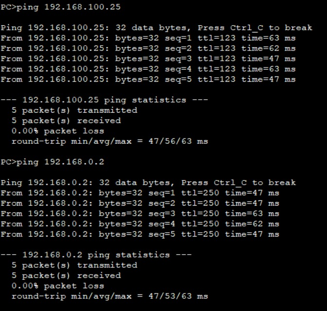

Connectivity between Access server and Backup server
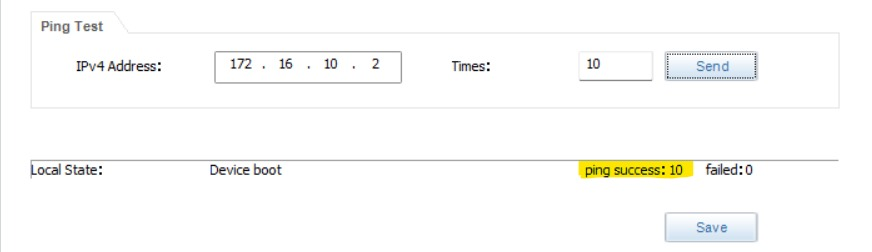
